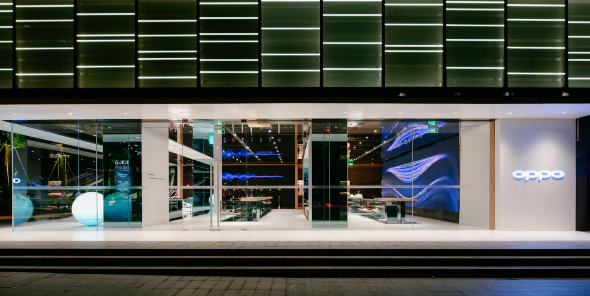

:+1: 点右上角 `Star`，点亮你的头像，让成都互联网氛围变得更好~

大家好，我是D哥，作为一位老的成都人。

很多朋友都在考虑回到作为新一线城市的成都发展，但是，又担心踩坑啦！

最近，我和群里的小伙伴们（基本上都在这些公司待过），花了一些时间，梳理了成都还不错的IT互联网公司，希望能帮助大家排坑。

一线机会多，二线也舒服，大家慎重选择😄

> :lollipop: 如果你对成都互联网公司很熟悉，欢迎提交 `Issue` 或者`Pull Request`，参与开源项目，期待你的贡献。
> :phone: 如果对成都互联网公司感兴趣，欢迎联系我内推，[戳这里](http://idea.javatiku.cn/qr.html)。 

----

# 大厂

## 腾讯

**简介**

腾讯公司成立于1998年11月，是目前中国最大的互联网综合服务提供商之一，也是中国服务用户最多的互联网企业之一。国内头部互联网企业。在成都的部门有游戏、腾讯云、csig等。

**官网**

https://www.tencent.com/zh-cn

**工作时间**

弹性，一般是10点到8点或者10点+，因为8点10点有班车

**薪资福利**

需要看上一份base，同事之间不能讨论工资等，高压线，待补充

**工作地点**

天府三街

## 滴滴

**简介**

滴滴出行是卓越的一站式移动出行平台；为5.5亿用户提供出租车、快车、专车、豪华车、公交、代驾、企业级、共享单车、共享电单车、共享汽车、外卖等多元化的出行和运输服务。在成都这边有社区电商的业务。

**官网**

https://www.didiglobal.com/

**工作时间**

弹性工作时间

**薪资福利**

18-22k，补充商业保险，五险一金，福利完善

**工作地点**

 高新区天府四街OCG 国际中心

## 京东

**简介**

京东在成都主要有两个职场，京东研究院，x事业部y事业部都有，在西部智谷，另一个职场在世外桃源，这个职场没有太多研发人员，偏业务。

**官网**

https://www.jd.com/

**工作时间**

偶尔加班，常规975

**薪资福利**

2年经验18k*14左右

**工作地点**

西部智谷，世外桃源广场

## 蚂蚁金服

**简介**

蚂蚁集团以“让信用等于财富”为愿景，致力于打造开放的生态系统，通过“互联网推进器计划”，助力金融机构和合作伙伴加速迈向“互联网+”，为小微企业和个人消费者提供普惠金融服务。依靠移动互联、大数据、云计算为基础，为中国践行普惠金融的重要实践。旗下有支付宝、余额宝、招财宝、蚂蚁聚宝、网商银行、蚂蚁花呗、芝麻信用等子业务板块。

**官网**

https://www.antgroup.com/

**工作时间**

不打卡，一般10点前到

**薪资福利**

13薪+N月绩效年终+期权

**工作地点**

天府四街

## 美团

**简介**

美团的使命是“帮大家吃得更好，生活更好”。作中国领先的生活服务电子商务平台，公司拥有美团、大众点评、美团外卖等消费者熟知App，服务涵盖餐饮、外卖、生鲜零售、打车、共享单车、酒店旅游、电影、休闲娱乐等200多个品类，业务覆盖全国2800个县区市。目前技术团队主要包括到家、到店、基础研发平台等BG。

**官网**

https://about.meituan.com/home

**工作时间**

弹性工作制，每天工作时间不低于9个小时，早上最迟打卡不晚于11点。一般团队都有晨会，因此大多数是九点半到十点半范围到。

**薪资福利**

整体薪资水平有竞争力。根据面试评级、目标职级、工作年限、上家流水等谈薪。年包由12基础工资+1个月绩效+2.5个月年终奖构成，绩效和年终奖和绩效挂钩，每半年评定一次，每年一次薪水普调。加班到晚上20点有30块餐补，21:30后免费打车。无其他福利，白开水管够。

**工作地点**

天府一街

## 字节跳动

**简介**

是最早将人工智能应用于移动互联网场景的科技企业之一，是中国北京的一家信息科技公司。公司以建设“全球创作与交流平台”为愿景 。字节跳动的全球化布局始于2015年 ，“技术出海”是字节跳动全球化发展的核心战略 ，其旗下产品有今日头条，西瓜视频，抖音，火山小视频，皮皮虾，懂车帝，悟空问答等。

**官网**

https://www.bytedance.com/zh

**工作时间**

弹性工作制，早上10点到晚上10点，部分团队23:00下班

**薪资福利**

薪资视情况，12基础工资+2-4月年终奖+500期权；房补+下午茶。

**工作地点**

天府四街

## 美的金融

**简介**

美的金融是美的集团的子公司，主要运用大数据和互联网工具，为产业链用户提供产业链融资、财富管理、美的支付等多样化金融服务。

**官网**

www.mideaepay.com

**工作时间**

双休，早上9点到晚上6点，偶尔加班（视项目情况）

**薪资福利**

薪资视情况，15k-28k，12基础工资+2-4月年终奖，下午茶。

**工作地点**

天府四街

## 科大讯飞

**简介**

科大讯飞股份有限公司（股票代码：002230）成立于1999年，是亚太地区知名的智能语音和人工智能上市企业。自成立以来长期从事语音及语言、自然语言理解、机器学习推理及自主学习等核心技术研究并保持了国际前沿技术水平。

**官网**

https://www.iflytek.com/index.html

**工作时间**

弹性工作制

**薪资福利**

3-5年，15k-20k·14薪

**工作地点**

天府新区

## 平安证券

**简介**

平安证券股份有限公司是中国平安（保险）集团股份有限公司旗下重要成员，截至2016年6月，平安证券注册资本为85.74亿元，净资产247.17亿元，总资产1021.03亿元。能者能够拿到很多的钱。

**官网**

https://stock.pingan.com/static/info/notice/noticelist.html

**工作时间**

基本准时下班

**薪资福利 **

5-10年，20-30k，五险一金，有奖金，带薪年假

**工作地点**

天府四街

## 久远银海

**简介**

久远银海是智慧民生和军民融合服务商，起源于中国工程物理研究院并由中物院国有控股，是中物院“军转民”支柱型企业。公司聚焦医疗医保、数字政务、智慧城市、军民融合四大战略方向，面向政府部门以及行业生态主体，以信息化、大数据应用和云服务，为民生国防赋能。

**官网**

http://www.yinhai.com/

**工作时间**

基本准时下班，周末偶尔加班

**薪资福利**

1-3年，7-12k, 五险一金, 年终奖, 生日福利

**工作地点**

锦江区，柳江

## 北京新氧科技有限公司

**简介**

2013年7月，新氧成立。业务版图覆盖教育、科普、内容、医械等领域。目前新氧业务覆盖中国、韩国、新加坡、日本、泰国5个国家的351座城市。吸引7000余家正规医美机构和25814名有执业资格的医生入驻；2500万用户在新氧平台上留下搜寻和消费的足迹。

**官网**

https://www.soyoung.com/

**薪资福利**

目前成都只招应届生，13k-18k·14薪 ，六险一金，餐补

**工作地点**

温江区光华大道

## Garmin佳明

**简介**

Garmin成立于 1989 年，注册地为瑞士沙夫豪森，研发总部位在美国，是具指标性的 GPS 企业。近 30 年前，Garmin以尖端的航空 GPS 导航产品进入市场，而后在航空、航海、车用市场都有完整的产品。目前已是航空、航海、车用、运动健身产品等市场的领先者。

**官网**

https://www.garmin.com.cn/

**工作时间**

周末双休

**薪资福利**

3-5年，10-15K，六险一金

**工作地点**

高新区天府软件园

## 联龙博通

**简介**

联龙博通总部设在北京，在深圳、上海、四川、西安、厦门、武汉、长沙设有分支机构。公司致力于为全球移动通信用户提供丰富多彩的移动电子交易服务，拥有“手机银行”、“移动商务”、“移动支付”三大服务产品平台 ，涵盖了移动电子商务的整个产业链。
**官网**

http://www.chinamworld.com/

**工作时间**

要加班

**薪资福利**

3-5年，8-15K，餐补、五险一金、十三薪、加班费

**工作地点**

天府四街

## 51Talk无忧英语

**简介**

 51Talk公司总部位于北京，目前在上海、深圳、武汉、菲律宾等地设有分公司和办公地点，是目前国内学员数量最大、外教最多的在线英语教育领导品牌。

**官网**

https://www.51talk.com

**工作时间**

基本准时下班，周末偶尔加班

**薪资福利**

3-5年，10-20K，五险一金，带薪年假，奖金

**工作地点**

天府新区

## 泛微

**简介**

泛微网络科技股份有限公司成立于2001年，总部设立于上海，专注于协同管理软件领域，并致力于以协同OA为核心帮助企业构建全员统一的移动办公平台。

**官网**

https://www.weaver.com.cn/

**薪资福利**

3-5年，15-30K，五险一金，带薪年假

**工作地点**

天府四街

## 北明软件

**简介**

中国最具成长性的IT解决方案及云计算服务提供商，自1998年成立以来，始终致力于为金融、电力、能源、政府、互联网/运营商、公共事业、制造业等行业提供综合性IT解决方案和云计算服务。注册资金7.38亿元人民币，全国25个分子公司，员工近3000多人。覆盖全国的业务营销网络和服务支持体系。

**官网**

http://www.bmsoft.com.cn/

**工作时间**

要加班

**薪资福利**

10k-16k·13薪，年终奖，5天以上年假

**工作地点**

武侯区楚峰国际

## 超图软件

**简介**

超图软件注册资本1.2亿元，总部设于北京，在上海、广州、杭州、成都、西安、长沙和沈阳设7个分公司，在香港设立全资子公司，控股日本超图株式会社。总部、分公司和全资子公司共有员工超过1000名。

**官网**

https://www.supermap.com/

**薪资福利**

1-3年，8-12K，五险一金、带薪年假

**工作地点**

双流县新川路

## 亚信

**简介**

亚信科技是中国电信行业最大的软件产品和相关服务提供商，拥有逾500种任务关键型“电信级”软件产品组合。公司积极拥抱5G、人工智能、物联网、大数据等新兴技术，依托强大的产品、服务、运营和集成能力，开拓新客户、开创新业务、探索新模式，助力各行业企业数字化转型。

**官网**

https://www.asiainfo.com/zh_cn/index.html

**工作时间**

弹性工作

**薪资福利**

1-3年，9k-11k·13薪 ，带薪年假

**工作地点**

武侯区高升桥

## 龙湖集团

**简介**

目前没有招聘需求，除非简历特别过硬能够打动HR

**官网**

https://www.longfor.com/

**工作时间**

基本不加班

**薪资福利**

本科8年，年薪40W+（不含补贴），补贴一个月约2300

**工作地点**

郫都区

## 完美世界

**简介**

完美世界是中国领先的网络游戏开发商和运营商之一。在完美世界，优秀团队及个人，不仅可以获得职业发展的激励，也可以获得影游行业的权威认可以及各级政府机构与组织的褒奖。整栋楼都是他们的。

**官网**

https://www.wanmei.com/

**工作时间**

不加班

**薪资福利**

3年18k

**工作地点**

软件园c区

## oppo 

**简介**

目前，OPPO 业务遍及40 多个国家和地区，拥有超过40万个销售网点。OPPO 在全球共有九大智能制造中心、六大研究所、四大研发中心，并在伦敦设有全球设计中心，拥有超过4 万名员工。成都市是研发中心。

**官网**

https://www.oppo.com/cn/

**工作时间**

之前实行996

**薪资福利**

3-5年 20K左右

**工作地点**

天府四街

## Naver China

**简介**

NAVER China (中文名：北京世联互动网络有限公司) 是韩国排名第一的搜索门户 NAVER (www.naver.com) 在中国成立的法人，于 2004 年 10 月在北京成立，致力于 NAVER Corporation 的中国区事业。

**官网**

http://www.navercorp.cn/

**工作时间**

8:30-5:30，无需996，无需大小周，基本不加班，加班会给相应的工资

**薪资福利**

3-5年约在14*14

**工作地点**

天府三街 太平洋保险大厦

## Fiture（拟合未来）

**简介**

目前业务方向为家居智能健身器材，暂不招人

**官网**

https://www.fiture.com/

**工作时间**

无强制加班，但是之前实行过一段时间的大小周

**薪资福利**

5-10年约在25-30K*12薪

**工作地点**

天府软件园E区

## 新希望金科

**简介**

新希望金科是全国领先的零售银行数字化转型技术服务商。新希望集团旗下。互联网金融，银行信贷业务。

**官网**

https://www.xwfintech.com/

**工作时间**

根据部门业务，有些部门需要一定的996，可能涉及通宵上线

**薪资福利**

3-5年15-20K左右，14薪

**工作地点**

中海国际

## 新网银行

**简介**

希望银行（筹）拟设注册资本金为30亿元，由新希望、银米科技（小米在川全资子公司）及红旗连锁三家主发起人联合川内多家知名民营企业共同设立。互联网金融，大股东是新希望集团。

**官网**

https://www.xwbank.com/#/index

**工作时间**

企业微信打卡，弹性。一般是9点半到晚七八点 。

**薪资福利**

3到5年，15-30k

**工作地点**

天府三街 地铁口附近

## 百词斩

**简介**

公司目前的产品分为app“百词斩"以及“薄荷阅读”、“番茄英语”、“蛋糕英语” 等其他细分英语学习类产品，其中App“百词斩”的用户已过八千万，领先目其他在线教育创业公司。成都独角兽。

**官网**

http://www.baicizhan.com

**工作时间**

企业微信打卡，弹性。一般是9点半到晚七八点 。

**薪资福利**

3-5年，15-30k

**工作地点**

天府三街 地铁口附近

## 中国网安

**简介**

中国网安是CETC重点打造的网络信息安全子集团，通过整合中国电科相关资源，建设网络信息安全的技术、人才和产业高地，支撑国家网络空间安全战略，引领技术创新，推动产业发展。国务院直属国企。

**官网**

http://cetcsc.cetc.com.cn/

**工作时间**

要加班，要出差

**薪资福利**

看部门，有些部门2年经验只有年薪14W+；有些部门3年经验年薪22左右

**工作地点**

武侯区创业路

## 企鹅医生

**简介**

腾康汇医由腾讯、医联、基汇资本、红杉资本合资成立的专业医疗服务机构。依托于医联40万优质执业医师资源，其中有23万三甲医院医师、30万主治及以上医师，平台深度问诊合作医师1000+。腾讯大股东。

**官网**

http://www.qieyisheng.com/HK.html

**工作时间**

不加班，上午10点半上班

**薪资福利**

2年18k左右

**工作地点**

万科大厦

## 天府通

**简介**

成都市公共交通出行垄断行业。在原公交、地铁行业基础上，已发展成为集加油、（占道）停车、出租车、公共自行车等公共交通领域；水电气代缴、菜市场等市政公用领域；校园（园区）一卡通等文化教育领域；社区医院、药房等医疗卫生领域；欢乐谷、杜甫草堂等旅游休闲领域；连锁超市、餐饮副食等商务消费领域等六大领域于一体的“城市一卡通”。

**官网**

http://www.cdtft.cn/

**薪资福利**

3到5年，8-20K

**工作地点**

 高新区财智中心

## 天府市民云

**简介**

核心产品“天府市民云”APP，成都市跨政府平台的一站式入口，在数据整合方面很牛逼，能够拿到很多政府数据。

**官网**

https://www.tfsmy.com/

**薪资福利**

3-5年，8-12K

**工作地点**

天府四街

## 华润雪花啤酒

**简介**

总部位于北京，成都这边是华润雪花的IT交付部门。

**官网**

https://www.snowbeer.com.cn

**薪资福利**

11-20K，五险二金、补充商业险、交通话费餐补等

**工作地点**

机场路

## 中建电商

**简介**

中建电子商务有限责任公司是由中国建筑总公司与其旗下的中国建筑发展有限公司共同投资成立，于2015年4月21日在四川省成都市青羊区注册，注册资本8000万元，在北京和成都分设办公区。中建全资。

**官网**

http://cscdc.cscec.com

**工作时间**

弹性工作，周末双休，带薪年假

**薪资福利**

看年限和上一份的base，5年可以给到年薪28万-34万

**工作地点**

天府二街三街中间

## 海康威视

**简介**

海康威视，全球安防行业龙头，是以视频为核心的智能物联网解决方案和大数据提供商，产品和解决方案应用到全球150多个国家和地区。很牛逼很牛逼很牛逼的实体企业。

**官网**

**工作时间**

不怎么加班

**薪资福利**

12-18K，五险一金+餐补+交补

**工作地点**

双流

## 腾木科技

**简介**

成立于2013年初，旗下拥有中国顶尖互联网酒吧娱乐品牌——微喵，该品牌致力于为酒吧娱乐业提供线上互动、场景营销增值等软件类产品。场景化互动娱乐。

**官网**

http://www.wemew.cn/

**工作时间**

弹性工作

**薪资福利**

13*13，六险一金+餐补+交补

**工作地点**

天府4街

# TODO List

**完善公司介绍**

- [x] 大厂
- [ ] 优质公司
- [ ] 垂直领域独角兽
- [ ] 在线教育
- [ ] 银行类
- [ ] 国企或者类似国企
- [ ] 初创公司